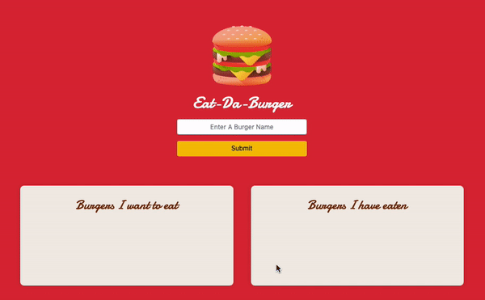

# :hamburger: 013-Eat-Da-Burger
Web app built with MySQL and Node.js (Express / Handlebars)

[Deployed Live on Heroku](https://eat-da-burger-rojo.herokuapp.com/)

[This project was added to my Portfolio](https://rojorevolution.github.io/002_bootstrap_portfolio/index.html)

# :zap: Description
This is a web app built with Node.js app that incorporates the use of a database through MySQL. The main purpose of the app was to gain familiarity with ORMs as well as templating through Handlebars.js.This entire project was successfully to a live DB with [Heroku App](https://heroku.com), and .env file was successfully used to keep sensitive server information away from prying eyes.

## Functionality
The app itself is pretty straight forward. Upon loading the landing page, if there are burger items within the DB, they will be listed either as "Burgers I'd like to eat" or Burgers I have eaten" The burgers in the "I'd like to eat" column include a button, that when clicked, will update that burger item in the DB, and move it to the "eaten" list. You can also create and add new burgers to the DB, and they will by default display in the "would like to eat" list.

# :zap: Installation
The program was built using Node.js. You will need to rn `npm install` to grab all depndencies. You will also need a local copy of MySQL installed on your machine. Be sure to enter your local MySQL password in the connection.js file. Schema and Seed files are also availabe to get your DB started

# :zap: Usage

Once everything is installed and your DB configured, simply run the server.js file through node to connect to your local server.

# :zap:	License

This project is covered under the license: MIT